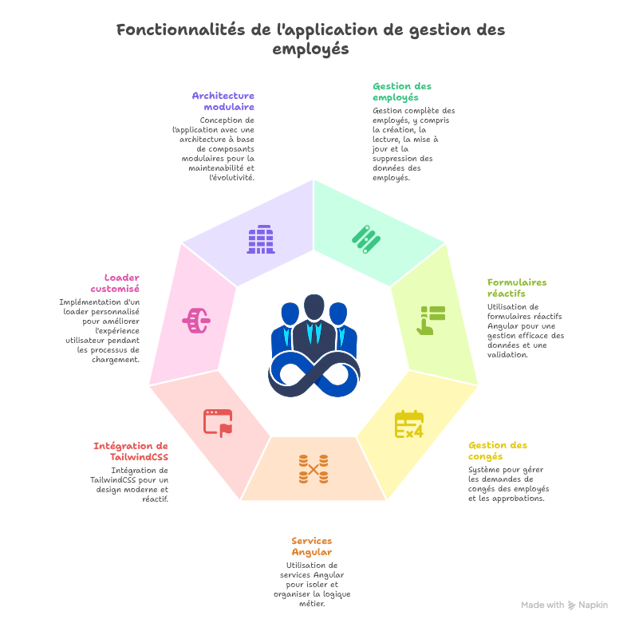
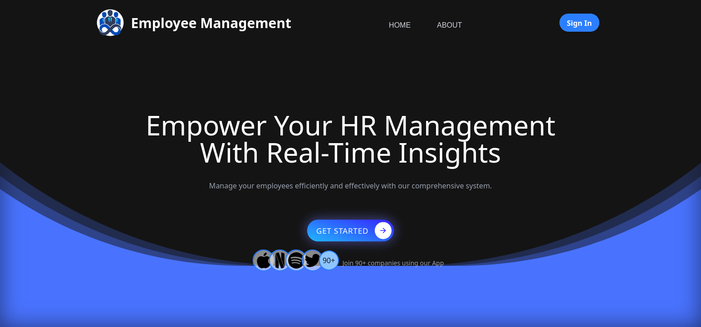
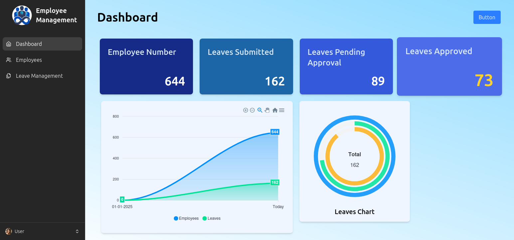
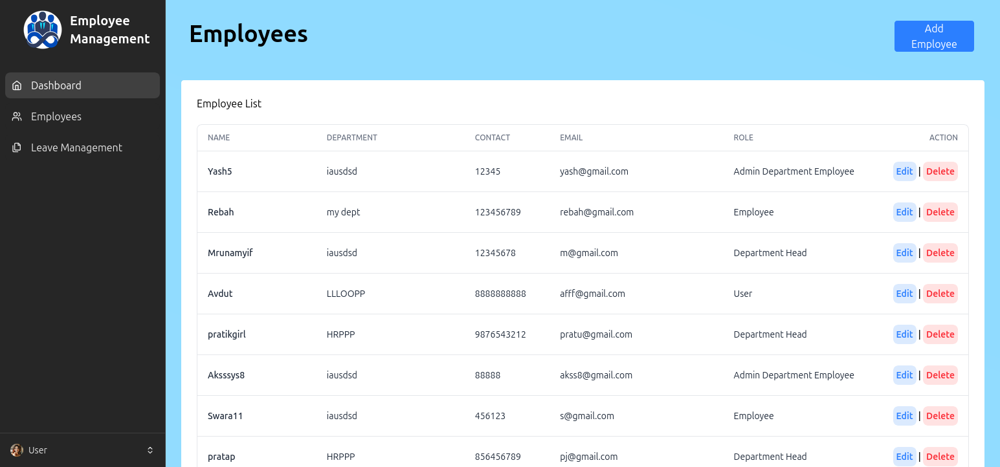

# 🧑‍💼 Employee Management App  
Application Angular pour la gestion des employés

             

---

## 📖 Description

**Employee Management App** est une application full Angular permettant de gérer efficacement les employés d’une entreprise à travers une interface simple et performante.

L’application permet notamment :

- ➕ Ajouter un employé  
- 📝 Modifier un employé  
- ❌ Supprimer un employé  
- 📄 Afficher la liste des employés   
- 🗓️ Gérer les *leaves* (permissions / congés)  
- 🔌 Communiquer avec une API via un **EmployeeService**  
- 🧩 Architecture propre et modulable : composants, services, modèles  

---

## 🚀 Fonctionnalités



### 👉 Fonctionnalités principales :

#### ✅ Gestion complète des employés (CRUD)  
#### ✅ Formulaires réactifs Angular (ReactiveForms)  
#### ✅ Système de gestion de congés (Leaves)  
#### ✅ Services Angular pour isoler la logique métier  
#### ✅ Intégration de TailwindCSS pour un design moderne  
#### ✅ Loader customisé  
#### ✅ Architecture à base de composants modulaires  

---

## 🛠️ Technologies utilisées

- 🅰️ **Angular 20** — Framework principal  
- 🎨 **TailwindCSS** — Styles utilitaires modernes  
- 🟦 **TypeScript** — Typage robuste  
- 🌐 **API du projet** — Données des employés et congés 👉
[FreeApi](https://freeapi.miniprojectideas.com/index.html)  
- ⚡ **Node.js 22** — Environnement d’exécution  

---

## 📦 Installation et Utilisation

### 1️⃣ Cloner le projet
```sh
git clone https://github.com/johanalain11/employee-management-app.git
cd employee-management-app
```

### 2️⃣ Installer les dépendances
```sh
npm install
```

### 3️⃣ Lancer l’application Angular
```sh
ng serve
```

➡️ Ouvrir dans le navigateur 👉 [http://localhost:4200](http://localhost:4200)

## 📂 Structure du projet
```bash
/employee-management-app
├── /src
│   ├── /app
│   │   ├── /assets # Dossier des multimédias
│   │   ├── /components # Dossier des composants
│   │   ├── /models     # Dossier des modèles: définition de la structure d'un produit
│   │   ├── /pages      # Dossier des pages du site
│   │   ├── /services   # Dossier des services
│   │   ├── app.config.ts
│   │   ├── app.css
│   │   ├── app.html
│   │   ├── app.routes.ts
│   │   ├── app.spec.ts
│   │   └── app.ts
│   ├── index.html
│   ├── main.ts
│   └── styles.css
├── .postcssrc.json
├── angular.json
├── package.json
├── README.md
├── tsconfig.app.json
├── tsconfig.json
└── tsconfig.spec.json
```

---

## 🎨 Aperçu de l'Interface
- Page de d'accueil


- Page du tableau de bord


- Page employés


---

## 📊 Exemple d’Utilisation

1. L’utilisateur ouvre l'application
2. L’utilisateur se connecte
3. Le tableau de bord est affiché
4. L'utilisateur se dirige vers l'onglet Employés'
5. L'utilisateur peut :
  - ➕ Ajouter un employé en cliquant sur le bouton Add
  - 📝 Modifier un employé
  - ❌ Supprimer un employé
6. La page Leaves permet :
  - ➕ Ajouter une permission
  - ✅ Accepter une permission
  - ❌ Supprimer une permission 
  

----------

## 🔮 Améliorations Futures

> [!NOTE]
> 
> -   Ajouter une vraie base de données et un backend (NestJS / Node.js)
> -   Mise en place de JWT + Guards Angular
> -   Ajout d’une authentification avec rôles (admin/user)
> -   Export PDF / Excel de la liste des employés
> -   Tableau avec pagination avancée
> -   Internationalisation (i18n)
>     
----------

## Auteur
**Johan Alain**

[GitHub](https://github.com/johanalain11/)

## 📜 Licence

Ce projet est sous licence MIT.

----------

✨ **N’hésite pas à contribuer !**  
💡 **Suggestions et retours sont les bienvenus !** 😊  
📩 **Contact :** [LinkedIn](www.linkedin.com/in/johanalain11) | Email [jank092016@gmail.com](mailto:jank092016@gmail.com)
